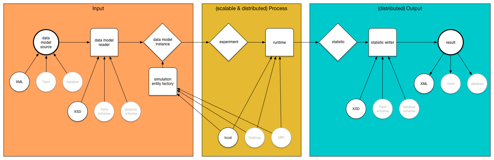

# Asimov - Agentbased Passenger Train Delay

## Execution Model

## Tools

* [OSM Common Library](https://github.com/kodapan/osm-common)
* [Railway Map API](http://wiki.openstreetmap.org/wiki/OpenRailwayMap/API)
* [OpenLayers](https://openlayers.org/)
* [Phaser JavaScript Game Engine](https://phaser.io/)
    * [Isometric Plugin](http://rotates.org/phaser/iso/)